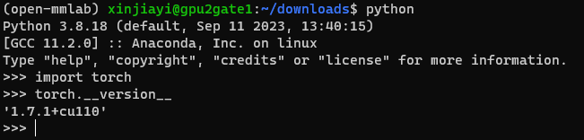

# COMP3340 Group 10 - Few Shot Learning

## Contact
- This repository contains code for Few Shot Learning on Oxford 17 Dataset
- For any question and enquiry, please feel free to reach out to Jiayi Xin (xinjiayi@connect.hku.hk)
- Thanks and enjoy =P

## Overview
**Prerequisite for Reproduction**
1. [Set up conda environment](#env_setup)
2. [Download data and checkpoint files and put them under the correct folder](#downloads)
3. [Run the commands to reproduce all the important results](#cmd_repro)

**Software, Hardware & System Requirements**
- Software
  - Set up environment as [following](#env_setup)
  - python==3.8.18
  - mmfewshot==0.1.0
  - mmdet==2.17.0
  - mmcv==1.3.14
- Hardware
  - Experiments are conducted on one NVIDIA GeForce RTX 2080 Ti
- System
  - Linux

**Note**
One model training typically takes 6-7 hours to run with one NVIDIA GeForce RTX 2080 Ti.

## Environment setup <a id="env_setup"/>

### Basic Setup (Also required by some other Group 10 repos)

**Step 1. Create virtual environment using anaconda**

```
conda create -n open-mmlab python=3.8 -y
conda activate open-mmlab
```

*Please make sure that you are create a virtual env with python version 3.8*

**Step 2 Install Pytorch from wheel**

```
wget https://download.pytorch.org/whl/cu110/torch-1.7.1%2Bcu110-cp38-cp38-linux_x86_64.whl#sha256=709cec07bb34735bcf49ad1d631e4d90d29fa56fe23ac9768089c854367a1ac9
pip install torch-1.7.1+cu110-cp38-cp38-linux_x86_64.whl
```

*Please double check that you install the correct version of pytorch using the following command*



**Step 3 Install cudatoolkit via conda-forge channel**

*You must be on the GPU compute node to install cudatoolkit and mmcv since GCC compiler and CUDA drivers only available on GPU computing nodes*

```
gpu-interactive
conda activate open-mmlab
conda install -c conda-forge cudatoolkit=11.0
```

**Step 4 Install torchvision, mmcv-full and mmcls package using pip**

*Make sure you are on GPU compute node!!*

- `gpu-interactive`

*Make sure you did not previously installed any relevant package*
*Following pip show command show output a message like "no such package found"*

```
pip show torchvision
pip show mmcv
pip show mmcv-full
pip show mmcls
```

*remove pip cache*

```
pip cache remove torchvision
pip cache remove mmcv
pip cache remove mmcv-full
pip cache remove mmcls
```

*install packages*

```
pip install torchvision==0.8.2
pip install mmcv-full==1.3.14 -f https://download.openmmlab.com/mmcv/dist/cu110/torch1.7.0/index.html
```


### MMFewShot Additional Setup

- **Install MMDetection**
  - [GitHub - open-mmlab/mmdetection: OpenMMLab Detection Toolbox and Benchmark](https://github.com/open-mmlab/mmdetection)
  - *Please install mmdet==2.17.0*
  - Need to be compatible with current mmcv versoin --> go to the realease page of mmdetection and download the zip of the code of tha version
  - [Releases · open-mmlab/mmdetection (github.com)](https://github.com/open-mmlab/mmdetection/releases?page=4)
- **Install MMFewshot**
  - *Please install mmdet==2.17.0 before installing mmfewshot*
  - *Please install mmfewshot==0.1.0*
  - [mmfewshot/docs/en/install.md at main · open-mmlab/mmfewshot (github.com)](https://github.com/open-mmlab/mmfewshot/blob/main/docs/en/install.md)

## Download data & checkpoints<a id="downloads"/>

[OneDrive Download Link](https://hku.hk)

## Commands to reproduce results<a id="cmd_repro"/>

### Reproduce midterm report results
Reproduce midterm report Section XX

### Train model command


```
python ./tools/classification/train.py \
./configs/classification/maml/flower/maml_conv4_1xb105_flower_5way-1shot.py \
--work-dir ./output/maml_conv4_1xb105_flower_5way-1shot_meta-test
```


---  


## MMFewShot Official Readme and Citation

Please also refer to [MMFewShot Official Readme](https://github.com/COMP3340-2024-GP11/MMFewShot_Flower_Classification/tree/add-flower-dataset-jx).

If you find this project useful in your research, please consider cite:

```bibtex
@misc{mmfewshot2021,
    title={OpenMMLab Few Shot Learning Toolbox and Benchmark},
    author={mmfewshot Contributors},
    howpublished = {\url{https://github.com/open-mmlab/mmfewshot}},
    year={2021}
}
```

