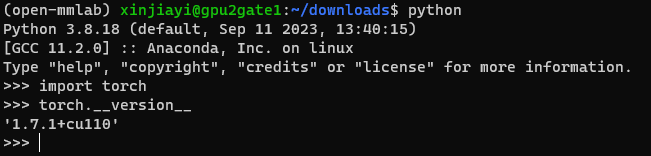
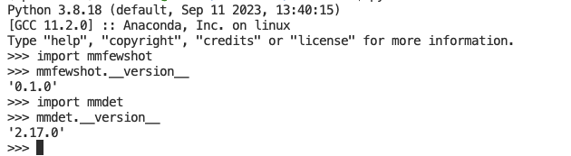
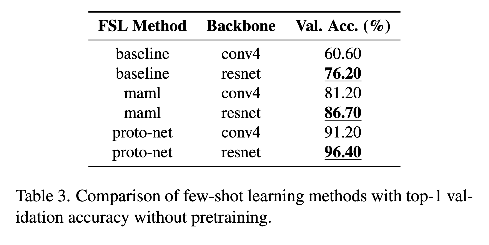
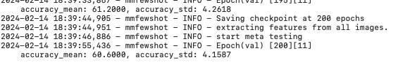
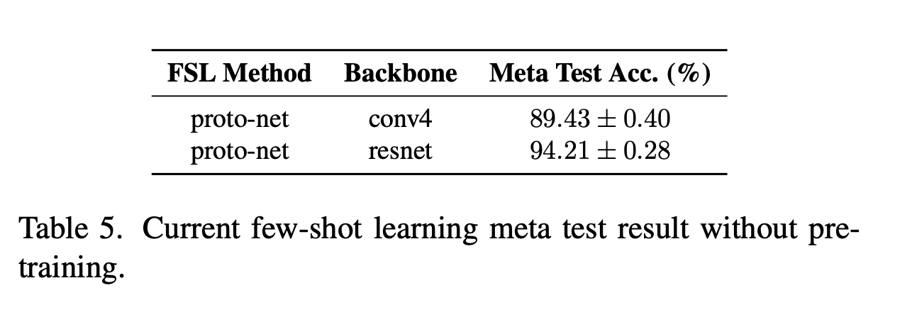
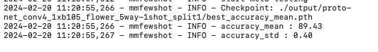

# COMP3340 Group 10 - Few Shot Learning

## Contact
- This repository contains code for Few Shot Learning on Oxford 17 Dataset
- For any question and enquiry, please feel free to reach out to Jiayi Xin (xinjiayi@connect.hku.hk)
- Thanks and enjoy =P

---

## Overview
**Prerequisite for Reproduction**
1. [Set up conda environment](#env_setup)
2. [Download data and checkpoint files and put them under the correct folder](#downloads)
3. [Run the commands to reproduce all the important results](#cmd_repro)

**Software, Hardware & System Requirements**
- Software
  - `python==3.8.18`
  - `mmfewshot==0.1.0`
  - `mmdet==2.17.0`
  - `mmcv==1.3.14`
  - `mmcls==0.15.0`
  - Please also refer to `mmfewshot_software_requirements.txt` if you have any questions (However, please **do follow [Set up conda environment](#env_setup) step-by-step** to ensure correct software environment setup)
- Hardware
  - Experiments are conducted on one NVIDIA GeForce RTX 2080 Ti
- System
  - Linux
  - One model training typically takes 6-7 hours to run with one NVIDIA GeForce RTX 2080 Ti

---

## Environment setup <a id="env_setup"/>

### Basic Setup (Also required by some other Group 10 repos)

**Step 1. Create virtual environment using anaconda**

```
conda create -n open-mmlab python=3.8 -y
conda activate open-mmlab
```

*Please make sure that you are create a virtual env with python version 3.8*

**Step 2 Install Pytorch from wheel**

```
wget https://download.pytorch.org/whl/cu110/torch-1.7.1%2Bcu110-cp38-cp38-linux_x86_64.whl#sha256=709cec07bb34735bcf49ad1d631e4d90d29fa56fe23ac9768089c854367a1ac9
pip install torch-1.7.1+cu110-cp38-cp38-linux_x86_64.whl
```

*Please double check that you install the correct version of pytorch using the following command*



**Step 3 Install cudatoolkit via conda-forge channel**

*You must be on the GPU compute node to install cudatoolkit and mmcv since GCC compiler and CUDA drivers only available on GPU computing nodes*

```
gpu-interactive
conda activate open-mmlab
conda install -c conda-forge cudatoolkit=11.0
```

**Step 4 Install torchvision, mmcv-full and mmcls package using pip**

*Make sure you are on GPU compute node!!*

- `gpu-interactive`

*Make sure you did not previously installed any relevant package*
*Following pip show command show output a message like "no such package found"*

```
pip show torchvision
pip show mmcv
pip show mmcv-full
pip show mmcls
```

*remove pip cache*

```
pip cache remove torchvision
pip cache remove mmcv
pip cache remove mmcv-full
pip cache remove mmcls
```

*install packages*

```
pip install torchvision==0.8.2
pip install mmcv-full==1.3.14 -f https://download.openmmlab.com/mmcv/dist/cu110/torch1.7.0/index.html
```


### MMFewShot Additional Setup

- **Install MMDetection**
  - [GitHub - open-mmlab/mmdetection: OpenMMLab Detection Toolbox and Benchmark](https://github.com/open-mmlab/mmdetection)
  - *Please install mmdet==2.17.0*
  - Need to be compatible with current mmcv versoin --> go to the realease page of mmdetection and download the zip of the code of tha version
    1. Go to the following mmdet release page: [Releases · open-mmlab/mmdetection (github.com)](https://github.com/open-mmlab/mmdetection/releases?page=4)
    2. `wget https://github.com/open-mmlab/mmdetection/archive/refs/tags/v2.17.0.zip` 
    3. Unzip the file and install `mmdet==2.17.0`
    4. In the `open-mmlab` environment, enter `python` to open interactive python terminal and enter `import mmdet; mmdet.__version__`. If there is no error and you see `2.17.0`, then installation is successful.
  
- **Install MMClassification**
  - *Please install mmcls==0.15.0*
  - `pip install openmim`
  - `mim install mmcls`

- **Install MMFewshot**
  - There are two code folders in `MMFewShot.zip` corresponding to two branches on GitHub: `main` and `add-flower-dataset-jx`
    - Go to any of the two folder, e.g., `cd MMFewShot_Flower_Classification-main`
    - `pip install -v -e .`
    - In the `open-mmlab` environment, enter `python` to open interactive python terminal and enter `import mmfewshot; mmfewshot.__version__`. If there is no error and you see `0.1.0`, then installation is successful.
      - 

---

## Download data & checkpoints<a id="downloads"/>

[OneDrive Data Download Link](https://connecthkuhk-my.sharepoint.com/:u:/g/personal/xinjiayi_connect_hku_hk/Eb0pLuTY5cNLn_urRLZzrUwBLeLKuG1Dj2YfB-DeqON7wg?e=GgrgEc)

### Folder structure after unzip

```
COMP3340-GP10-FewShowLearning
|____FSL_branch_add_flower_dataset_jx
| |____data
| |____output
| |____test_output
|____FSL_branch_main
| |____data
| |____output
| |____test_output

```

### Where to place data & checkpoints
Please put the subfolders under code folder of the the corresponding branch.

- For branch `main`use the three subfolders under `COMP3340-GP10-FewShowLearning/FSL_branch_main`:
```
FSL_main_branch
| |____data
| |____output
| |____test_output
| |____ ...
```

For branch `add-flower-dataset-jx` use the three subfolders under `COMP3340-GP10-FewShowLearning/FSL_branch_add_flower_dataset_jx`:
```
FSL-add-flower-dataset-jx
| |____data 
| |____output 
| |____test_output 
| |____ ...
```


---

## Commands to reproduce results<a id="cmd_repro"/>

- To reproduce the results presented in the midterm report, please use the code and data in the `main` branch.
- To explore the performance of support-set|query-set split and meta-testing, please use the code and data in the `add-flower-dataset-jx` branch.

### Reproduce midterm report results
- Reproduce midterm report Table 3
  - 
  - To avoid training the model (takes 6-7 hours on a single GPU), you can simply check the training logs under subfolders of `./output`
    - 

- Reproduce midterm report Table 5
  - 
  - To avoid running the testing (takes several hours on a single GPU), you can simply check the logs under ./test_output
    - 

- If you insist to train and test the FSL models, you can refer to example commands listed in [the following section](#aft_midterm).


### Exploration after midterm<a id="aft_midterm"/>
- Note: we did not include addtional results in the presentation since we do not have enough time.
- Please make sure that you using code and data in the `add-flower-dataset-jx` branch.

#### Example commands for experiments

- Example train command:
```
python ./tools/classification/train.py \
    ./configs/classification/baseline_plus/flower/baseline-plus_conv4_1xb64_flower_5way-1shot.py \
    --work-dir ./output/baseline-plus_conv4_1xb64_flower_5way-1shot_meta-test \
    --gpu-id 0
```

- Example test command:
```
python ./tools/classification/scripts/meta_test/flower_meta_test.py \
--config-fn flower_meta-test_5way-1shot \
--ckpt-fn baseline_conv4_1xb64_flower_5way-1shot \
--ckpt-choice best_accuracy_mean
```

#### Example bash scripts for experiments
- Bash script for training:
```
source tools/classification/scripts/train/flower_baseline.sh
source tools/classification/scripts/train/flower_baseline-plus.sh
source tools/classification/scripts/train/flower_maml.sh
source tools/classification/scripts/train/flower_proto-net.sh
```

- Bash script for testing:
```
source tools/classification/scripts/meta_test/flower_meta_test_all.sh
```

#### Example python scripts for processing results

- Python scripts for generating train and test results
```
python tools/classification/scripts/eval/eval_val_acc.py
python tools/classification/scripts/eval/eval_meta_test.py
```


---

## MMFewShot Official Readme and Citation

Please also refer to [MMFewShot Official Documentation](https://mmfewshot.readthedocs.io/en/latest/) if you have any doubts.

If you find this project useful in your research, please consider cite:

```bibtex
@misc{mmfewshot2021,
    title={OpenMMLab Few Shot Learning Toolbox and Benchmark},
    author={mmfewshot Contributors},
    howpublished = {\url{https://github.com/open-mmlab/mmfewshot}},
    year={2021}
}
```

